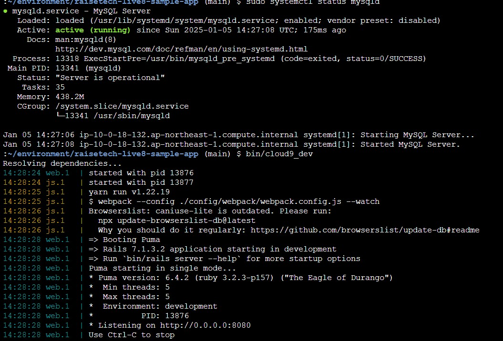
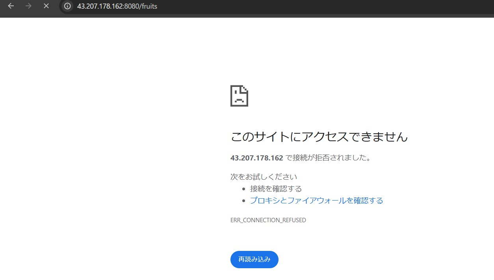
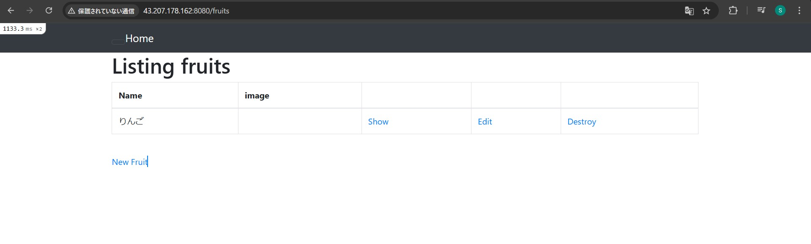
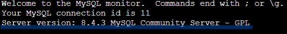
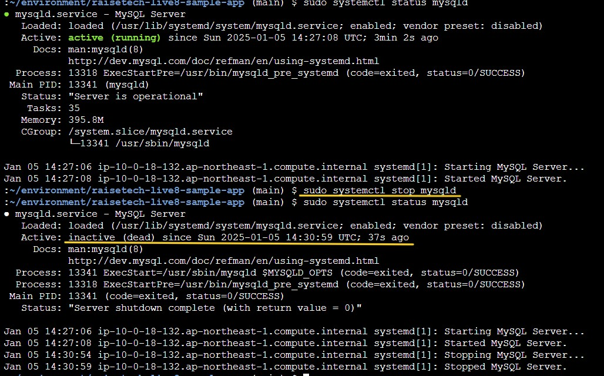
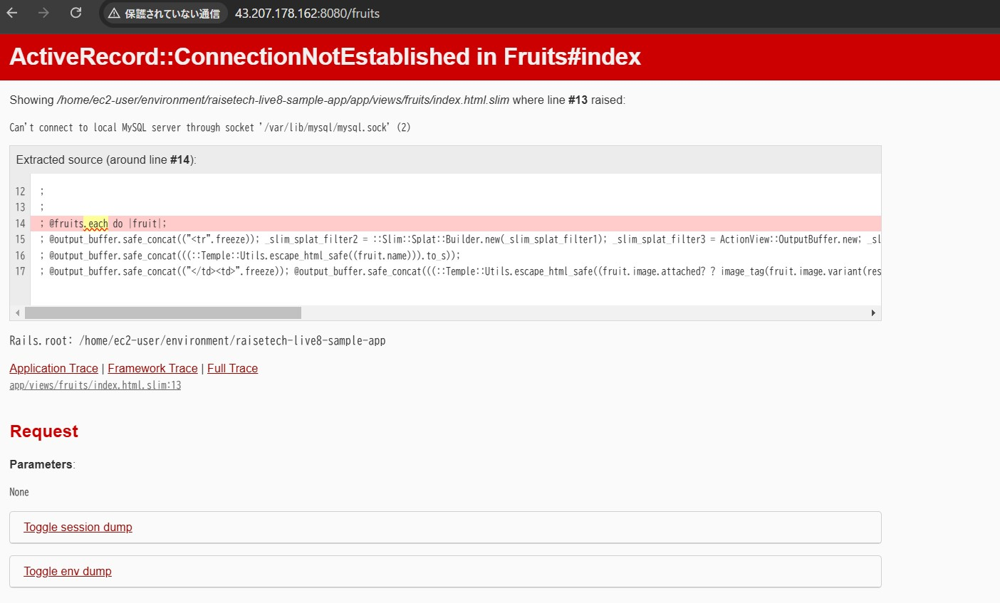

# ** 第3回課題 **

## 1. AP サーバーについて調べる
- AP サーバーの名前とバージョン
  - Puma 6.4.2

- AP サーバーを終了させた場合、引き続きアクセスできますか
  - アクセス出来ません

- APサーバを起動後、アクセスできるか
  - アクセス出来ます

## 2. DB サーバーについて調べる
- DB サーバーの名前とバージョン
  - mysql 8.4.3

- DB サーバーを終了させた場合、引き続きアクセスできますか
  - 終了

  - アクセス出来ません

- Rails の構成管理ツールの名前は何でしたか
  - bundler

## 3. 課題から学んだこと・感じたこと
- コードの理解が弱いと感じたので、課題終了後ノートをまとめ直す。
- 動画を10回以上見ていく＋調べたことを照らし合わせるうちにだんだん何をしているのかわかってきた。何度も質問させていただいたにも関わらず、時間がかかりすぎてしまったことが兎に角反省点。
- まずやってみようという精神で始めてしまったが故に、用語や作業を進めていく工程がわからなくなってしまい、何度も同じところで挫折した。
- 最終的には1番目に取り組んだ時点でアプリケーション起動出来ていたことが分かったが、始めの段階ではそれすら気づけていなかったので、まず取り組む前に調べてみることが大切だと感じた。
